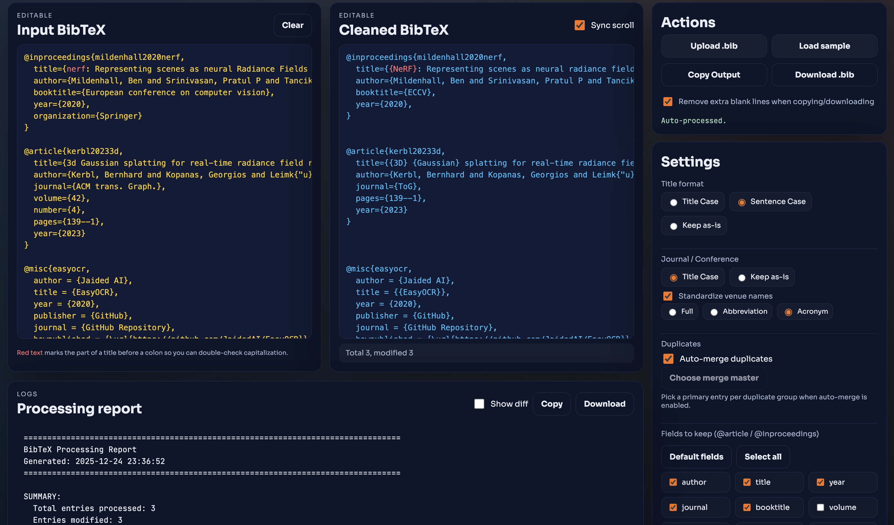

# BibTeX Cleaner

**Try it online (GitHub Pages):** https://luo-ziyuan.github.io/bibtex-cleaner/

This folder contains a static web UI for cleaning and formatting BibTeX. The app runs the Python cleaning logic in the browser via Pyodide and shows the processed output side-by-side with the original input.

## Live site

URL:
- `https://luo-ziyuan.github.io/bibtex-cleaner/`

## Features

- **Title formatting**: Title Case / Sentence case / Keep as-is; plus automatic removal of trailing sentence periods where safe.
- **Venue formatting**: Formats `journal` / `booktitle` casing; optional venue standardization (Full / Abbreviation / Acronym) using curated lists in `docs/data/venues/`.
- **Field filtering**: Select which fields to keep for `@article` and `@inproceedings` entries.
- **Duplicates**: Detect potential duplicates and optionally auto-merge; a modal lets you choose the merge master per group when auto-merge is enabled.
- **Alignment-first output**: Output keeps entry positions aligned with input by preserving per-entry line budgets and normalizing the total line count. During merge, master entries are serialized with a capped line budget to avoid pushing later entries out of alignment.
- **Diff view**: An optional unified diff (input → cleaned) generated with Python’s `difflib` for quick review.

## Diff view behavior

- The diff is a unified diff with context lines. It shows changed hunks plus surrounding context, not a full duplicate of both files.
- Copy/Download actions follow the current view: when “Show diff” is enabled, Copy/Download operate on the diff text instead of the log.

## Data files

The web app loads additional data into Pyodide’s in-memory filesystem:

- `docs/data/all_bibtex_fields.txt`: list of known BibTeX fields.
- `docs/data/lowercase_words.txt`: words to keep lowercase in Title Case.
- `docs/data/preserve_terms.txt`: terms to preserve as-is.
- `docs/data/protected_terms.txt`: tokens/acronyms to protect from case conversion.
- `docs/data/venues/*.yml`: venue normalization tables by domain.

## Source layout

- `docs/index.html`: page layout and controls.
- `docs/style.css`: UI styling.
- `docs/app.js`: UI logic (events, Pyodide setup, rendering, diff view).
- `docs/process_core.py`: Python cleaning/formatting engine executed in Pyodide.
